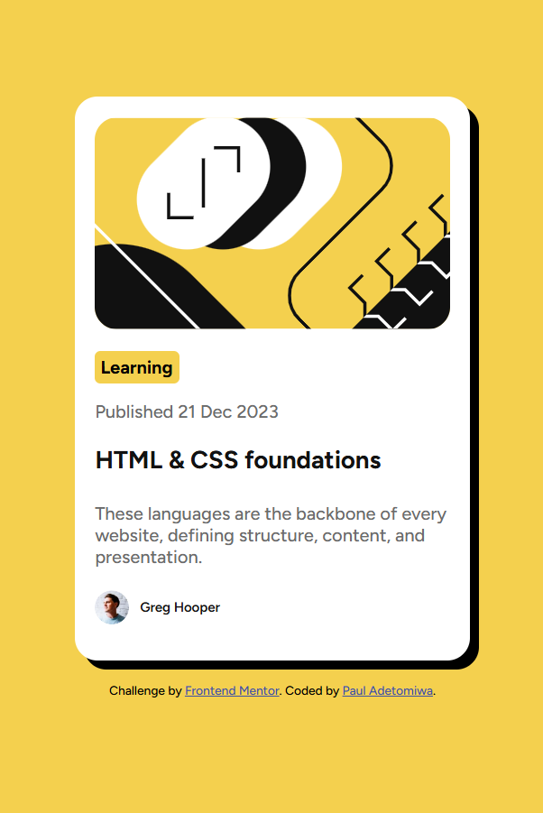

# Frontend Mentor - Blog preview card solution

This is a solution to the [Blog preview card challenge on Frontend Mentor](https://www.frontendmentor.io/challenges/blog-preview-card-ckPaj01IcS). Frontend Mentor challenges help you improve your coding skills by building realistic projects. 

## Table of contents

- [Overview](#overview)
  - [Screenshot](#screenshot)
  - [Links](#links)
- [My process](#my-process)
  - [Built with](#built-with)
  - [What I learned](#what-i-learned)
- [Author](#author)


## Overview

- This is a solution to a blog preview card challenge on Frontend Mentor. Involves using HTML and CSS only to create a blog preview of a blog post, majorly found in most websites all over the web. 

### Screenshot



### Links

- https://github.com/PaulAdetomiwa/blog-preview-card/blob/main/index.html

## My process

### Built with

- Semantic HTML5 markup
- CSS custom properties
- CSS Grid
- CSS Flexbox 

### What I learned

```html
<div class="container">
  <div class="first_half">
    
  </div>
  <div class="second_half">
    <h3>Learning</h3>

    <p>Published 21 Dec 2023</p>

    <h2>HTML & CSS foundations</h2>

    <p>These languages are the backbone of every website, defining structure, content, and presentation.</p>

    <div class="me"><span>Greg Hooper</span></div>
  </div>
</div>
```
- This part was a bit tricky. My idea was to cut up the .container div into two parts, two divs without borders, in a column. This would overlap the .container div with no space left, making it easier to input elements without them scattering.

```css
.container {
      font-family: 'Figtree', sans-serif;
      background-color: hsl(0, 0%, 100%);
      width: 350px;
      height: 500px;
      border-radius: 20px;
      display: flex;
      flex-direction: column;
      align-items: center;
      box-shadow: 8px 8px 0 black; 
      position: relative;
      overflow: hidden;
    }

    .first_half, .second_half {
      position: relative; 
      width: 90%; 
    }
```
- This is how, using CSS, I was successfully able to divide .container into two parts, which would later be the containers for the other elements within the webpage.

- I also set a minimum height for the body to ensure responsiveness. 

## Author

- Website - [Paul Adetomiwa](https://github.com/PaulAdetomiwa)
- Frontend Mentor - [@PaulAdetomiwa](https://www.frontendmentor.io/profile/PaulAdetomiwa)
- X - [@AdewolePaul6](https://www.x.com/AdewolePaul6)